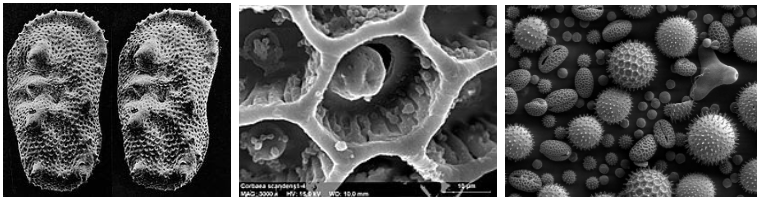
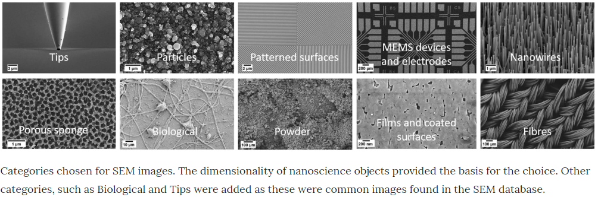
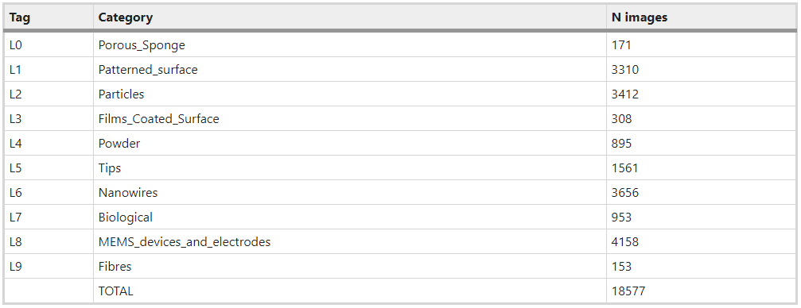
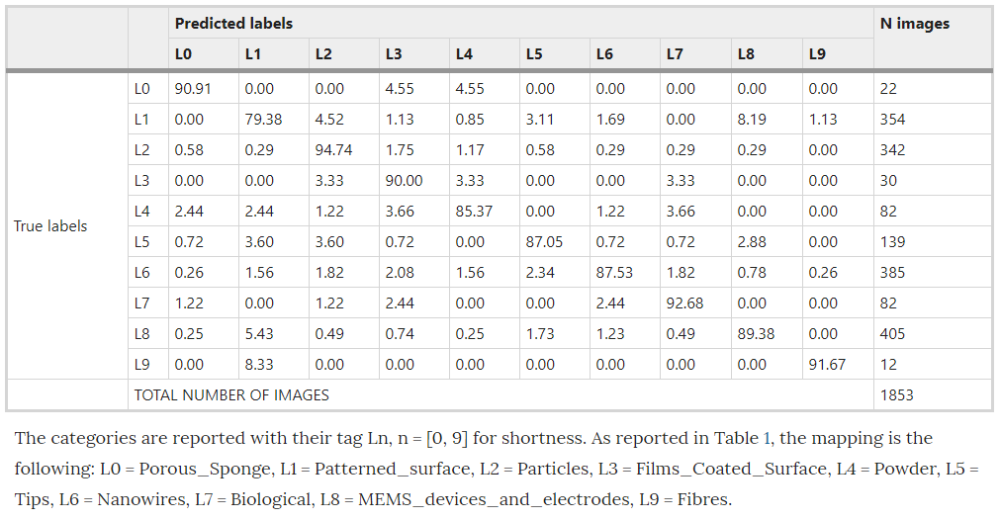
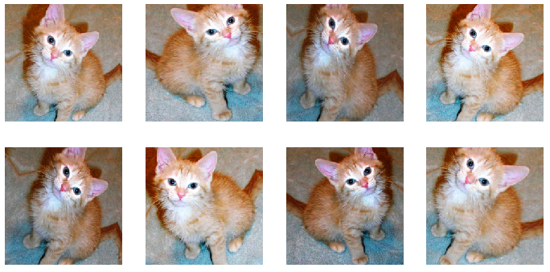

# The Augmented Scientist Part 1: Practical Application Machine Learning in Classification of SEM Images

Welcome to the first blog in our Augmented Scientist series, where we will be looking at how machine learning can be used to improve the way that Scientists work on a day-to-day basis. As this series grows we’ll be looking at more applications for ML to work as a research aid for scientists, removing a lot of repetitive analysis work and allowing them to explore their fields deeper. Both my wife and I come from science backgrounds, her chemistry and me physics. What struck me when I started working on machine learning is the enormous opportunity to speed up much of the tedious analysis that consumes so much time in research labs.

As our first exploration into the concept of the Augmented Scientist, our goal here is to see if we can build a classifier that can identify patterns in [Scanning Electron Microscope](https://en.wikipedia.org/wiki/Scanning_electron_microscope) (SEM) images, and compare the performance of our classifier to the current state-of-the-art. Later posts will investigate more focused applications of SEM image classification.

## What is SEM?
The first area that we’re going to look at is SEM image analysis, a technique my wife, as an electrochemist, has worked with extensively throughout her career. SEM is used extensively in chemistry and biology to create images of surfaces at a nanometer scale. It works by scanning a surface with a focused electron beam. The reflection of electrons off the surface creates an image of the topography and composition of the surface.

 

source: [https://en.wikipedia.org/wiki/Scanning_electron_microscope](https://en.wikipedia.org/wiki/Scanning_electron_microscope)

This type of detailed imaging has a vast array of applications, each one having different analysis requirements, such as optimizing the surfaces of electrodes in biosensors, or for producing electricity in fuel cells. The structure of the surface can tell us a lot about the properties and characteristics of an object.

## Previous Work:
In this blog post we’re going to see if we can make any advancements on the work of [Modarres et al 2017](https://www.nature.com/articles/s41598-017-13565-z#Sec2), who previously looked at classifying the patterns in 18,577 SEM images (you can find the dataset [here](https://b2share.eudat.eu/records/19cc2afd23e34b92b36a1dfd0113a89f)). These examples show you the type of patterns categorised in Modarres et al 2017’s dataset, who’s labels are Tips, Particles, Patterned Surfaces, MEMS devices and electrodes, Nanowires, Porous Sponge, Biological, Powder, Films Coated Surfaces and  Fibres.

 
source: [https://www.nature.com/articles/s41598-017-13565-z#Sec2](https://www.nature.com/articles/s41598-017-13565-z#Sec2)

The blow tables shows the distrution of images in the categories.

 

source: [https://www.nature.com/articles/s41598-017-13565-z#Sec2](https://www.nature.com/articles/s41598-017-13565-z#Sec2)

Using the pretrained Inception-v3 model, implemented in Tensorflow, Modarres et al achieved an accuracy of ~90%, with a precision of ~80% and a recall@1 of ~90%. Modarres et al also reported that an imbalance in the dataset had no effect on the classifier’s performance in accurately predicting the under represented categories. Their confusion matrix, shown below, shows that the least populated categories, Porous Sponge, Films Coated Surface and Fibers, all performed quite well. Modarres et al credited this to the distinct patterns of these categories. (Note: the values presented in Modarres et al’s confusion matrix are percentages of the validation sample for each actual/true label)

source: [https://www.nature.com/articles/s41598-017-13565-z#Sec2](https://www.nature.com/articles/s41598-017-13565-z#Sec2)

Two things that are worth bearing in mind at this point is that Modarres et al did not use any data augmentations, and the training process for the Inception-v3 implementation took ~7 min on 2 GPUs.

## Our Approach:
Wanting to see if we could achieve a higher accuracy than Modarres et al, we recreated their study with some of our own changes. First off we used the Resnet 50 implementation on the Fastai v1 framework and executed on a Colab GPU. To avoid overfitting, we adopted two approaches introduced by Fast.ai: Data augmentation and progressive resizing.

### Data Augmentation:
Data augmentation is essentially altering/distorting each image, effectively creating a new image. Fastai v1 has a great tool called get_transforms that handles this process for us. The [get_transforms](https://docs.fast.ai/vision.transform.html) function transforms the images in a number of different ways, such as flipping, rotating, changing its contrast and distorting it, meaning that small datasets effectively become much bigger.

sources: [https://docs.fast.ai/vision.transform.html](https://docs.fast.ai/vision.transform.html)

### Progressive Resizing:
Progressive resizing is an approach that was introduced by [Jeremy Howard](https://twitter.com/jeremyphoward) at [Fast.ai](https://www.fast.ai/). The concept is to crop the images in the dataset to a much smaller size, then after we’ve trained the model on the cropped images we increase their size and train the model again. We repeat this process a number of times, each time increasing the size of the images in the dataset. In this case we started with images of size 64x64 pixels. We trained the Resnet 50 on this dataset for a total of 15 epochs and then increased it iteratively to 128 and finally 224. Progressive resizing has two advantages. First off a lot of the early training is carried out on smaller images, which means the computational cost is lower and training takes less time. Secondly, repeatedly changing the size of the images and retraining the model can make it very difficult for the model to overfit. This means that your final model is more stable on new data it’s never seen before.

## Results:
Our implementation can be found in our GitHub repository, [here](https://github.com/skellig-ai/ikeaney.github.io/blob/master/SEM_Classification_ResNet50.ipynb). We achieved an overall accuracy of 94.5%, more than 4.5% of an increase on the previous state-of-the-art by Modarres et al, although our training process did take nearly 400 mins. Given that there is an imbalance in the data set, it is useful to consider metrics other than accuracy, such as [precision and recall](https://developers.google.com/machine-learning/crash-course/classification/precision-and-recall). Precision is essentially what proportion of the positive identification is actually correct, while recall is the proportion of actual positives which were identified correctly. Our model, while slightly over-fitting, achieved a precision of 94.2% and a recall of 91.8%. Comparing these to the values that Modarres et al reported of ~80% and ~90% respectively indicates that our model also performs better on the underrepresented categories in the dataset.

## Concluding Remarks:
I hope you enjoyed the first blog post in our Augmented Scientist series. This series will explore more avenues where machine learning can be used to assist the work of Scientists across many disciplines. If you’re interested in getting involved, or have examples of where you’ve used machine learning to augment your own work please let us know, we’d love to hear from you.

#### Author
Iain Keaney
[LinkedIn](https://www.linkedin.com/in/iain-keaney-9a668b47/)    [Twitter](https://twitter.com/Iain_Keaney)
